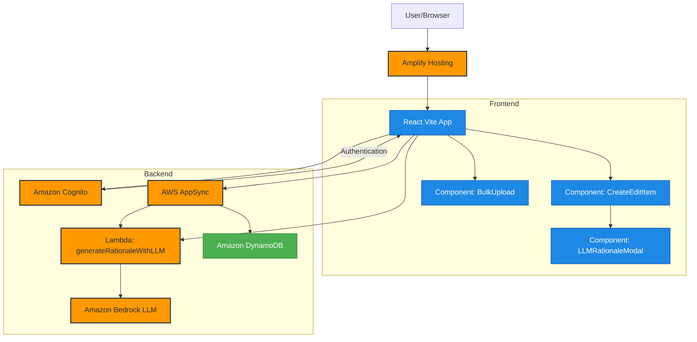

## AWS Amplify React+Vite Starter Template

This repository provides a starter template for creating applications using React+Vite and AWS Amplify, emphasizing easy setup for authentication, API, and database capabilities.

## Overview

This template equips you with a foundational React application integrated with AWS Amplify, streamlined for scalability and performance. It is ideal for developers looking to jumpstart their project with pre-configured AWS services like Cognito, AppSync, and DynamoDB.

## Features

- **Authentication**: Setup with Amazon Cognito for secure user authentication.
- **API**: Ready-to-use GraphQL endpoint with AWS AppSync.
- **Database**: Real-time database powered by Amazon DynamoDB.
- **LLM Integration**: AI-powered rationale generation using Amazon Bedrock.
- **Bulk Upload**: CSV file processing for bulk item creation.

## Architecture

The application uses AWS Amplify Gen 2 with the following AWS services:




## Key Components

- **CreateEditItem**: Form component for creating and editing items with AI-assisted rationale generation
- **BulkUpload**: Component for uploading and processing CSV files to create multiple items at once
- **LLMRationaleModal**: Modal component for displaying and accepting AI-generated content

## LLM Integration

This project includes an integration with Amazon Bedrock for generating rationales using AI:

1. The Lambda function `generateRationale` connects to Amazon Bedrock to generate content
2. Users can request AI-generated rationales from the CreateEditItem component
3. AI-generated content can be reviewed and accepted through the LLMRationaleModal

## Deploying to AWS

For detailed instructions on deploying your application, refer to the [deployment section](https://docs.amplify.aws/react/start/quickstart/#deploy-a-fullstack-app-to-aws) of our documentation.

## Local Development

```bash
# Install dependencies
npm install

# Start the development server
npm run dev

# Run tests
npm test

# Build for production
npm run build
```

## Security

See [CONTRIBUTING](CONTRIBUTING.md#security-issue-notifications) for more information.

## License

This library is licensed under the MIT-0 License. See the LICENSE file.