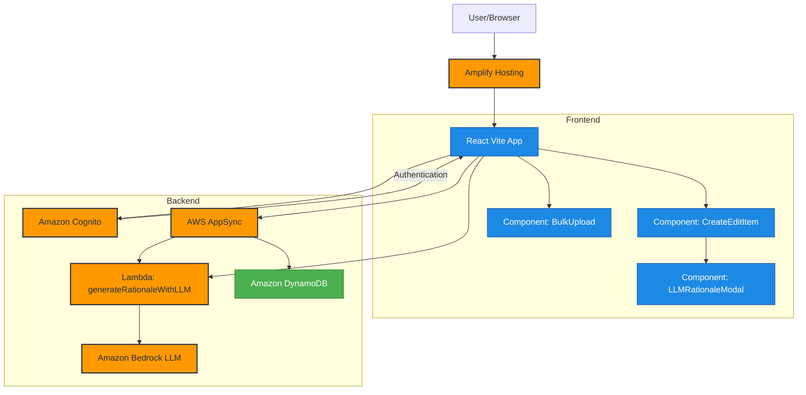

```mermaid
graph TD
    User[User/Browser] --> AmplifyHosting[Amplify Hosting]
    AmplifyHosting --> ReactApp[React Vite App]
    
    ReactApp --> Cognito[Amazon Cognito]
    ReactApp --> AppSync[AWS AppSync]
    ReactApp --> Lambda1[Lambda: generateRationaleWithLLM]
    
    AppSync --> DynamoDB[Amazon DynamoDB]
    AppSync --> Lambda1
    
    Lambda1 --> BedrockLLM[Amazon Bedrock LLM]
    
    Cognito -- Authentication --> ReactApp
    
    subgraph "Frontend"
        ReactApp
        CreateEditItem[Component: CreateEditItem]
        BulkUpload[Component: BulkUpload]
        LLMRationaleModal[Component: LLMRationaleModal]
        ReactApp --> CreateEditItem
        ReactApp --> BulkUpload
        CreateEditItem --> LLMRationaleModal
    end
    
    subgraph "Backend"
        AppSync
        DynamoDB
        Cognito
        Lambda1
        BedrockLLM
    end
    
    classDef aws fill:#FF9900,stroke:#232F3E,stroke-width:2px,color:#232F3E;
    classDef component fill:#1E88E5,stroke:#0D47A1,stroke-width:1px,color:white;
    classDef storage fill:#4CAF50,stroke:#2E7D32,stroke-width:1px,color:white;
    
    class AmplifyHosting,Cognito,AppSync,Lambda1,BedrockLLM,DynamoDB aws;
    class CreateEditItem,BulkUpload,LLMRationaleModal,ReactApp component;
    class DynamoDB storage;
``` 