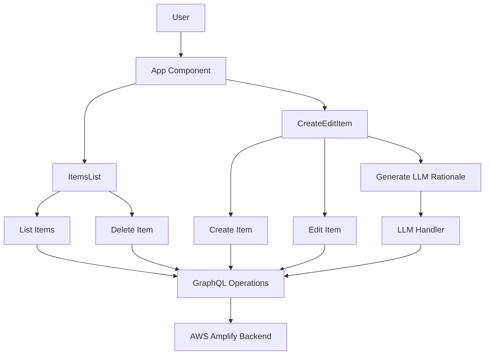
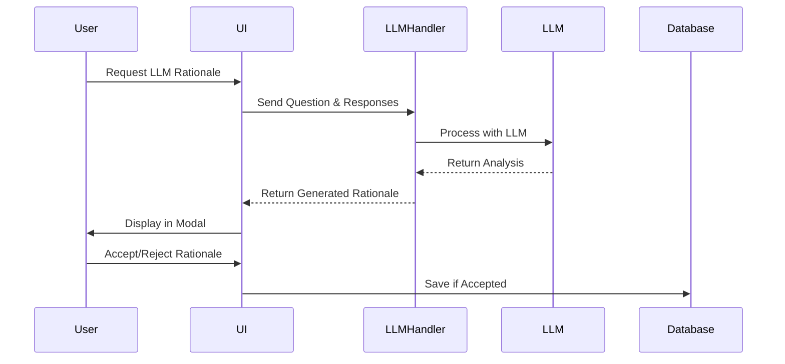

# AWS Amplify Gen2 React Helper Tool - Design Document

## 1. Overview
This is a React-based web application built with AWS Amplify Gen2, designed to manage and manipulate question items with multiple-choice responses and rationales. The application uses modern React practices, TypeScript, and AWS Cloudscape Design System for the UI. It includes LLM (Large Language Model) integration for automated rationale generation and answer validation.

## 2. Architecture

### 2.1 Technology Stack
- **Frontend Framework**: React 18 with TypeScript
- **Build Tool**: Vite
- **UI Framework**: AWS Cloudscape Design System
- **Backend**: AWS Amplify Gen2
- **Routing**: React Router v7
- **Testing**: Vitest with React Testing Library
- **State Management**: React Hooks
- **LLM Integration**: AWS Lambda with LLM capabilities

### 2.2 Project Structure
```
amplify-gen2-react-helper-tool/
├── amplify/                 # Amplify backend configuration
│   ├── auth/               # Authentication settings
│   ├── data/               # Data model definitions
│   └── backend.ts          # Backend configuration
├── src/
│   ├── components/         # React components
│   │   ├── LLMRationaleModal.tsx  # LLM rationale display
│   │   ├── RationaleDisplay.tsx   # Rationale rendering
│   │   ├── EditableRationale.tsx  # Rationale editing
│   │   └── ...            # Other components
│   ├── graphql/           # GraphQL operations
│   ├── utils/             # Utility functions
│   │   └── formatUtils.tsx # Text formatting utilities
│   ├── assets/            # Static assets
│   └── App.tsx            # Main application component
├── public/                 # Public static files
└── package.json           # Project dependencies
```

## 3. Core Components

### 3.1 Data Model
The application manages `Item` entities with the following structure:
```typescript
type Item = {
  QuestionId: number;
  CreatedDate: string;
  Question: string;
  Type: string;
  Status: string;
  Key?: string;
  Notes?: string;
  Rationale: string;
  CreatedBy: string;
  responseA: string;
  rationaleA: string;
  responseB: string;
  rationaleB: string;
  responseC: string;
  rationaleC: string;
  responseD: string;
  rationaleD: string;
  responseE?: string;
  rationaleE?: string;
  responseF?: string;
  rationaleF?: string;
  responseG?: string;
  rationaleG?: string;
  responseH?: string;
  rationaleH?: string;
  // LLM-generated fields
  LLMKey?: string;
  LLMRationaleA?: string;
  LLMRationaleB?: string;
  LLMRationaleC?: string;
  LLMRationaleD?: string;
  LLMRationaleE?: string;
  LLMRationaleF?: string;
  LLMGeneralRationale?: string;
  Topic?: string;
  KnowledgeSkills?: string;
  Tags?: string;
  responsesJson?: string;
  createdAt?: string;
  updatedAt?: string;
};
```

### 3.2 Main Components

#### 3.2.1 App Component
- Root component that sets up routing
- Routes:
  - `/` - Items list view
  - `/items` - Items list view
  - `/items/new` - Create new item
  - `/items/:id/edit` - Edit existing item

#### 3.2.2 ItemsList Component
- Displays a table of items using Cloudscape Design System
- Features:
  - Loading state handling
  - Error handling
  - Delete confirmation modal
  - Sorting capabilities
  - Empty state handling
  - Actions (Edit/Delete)

#### 3.2.3 CreateEditItem Component
- Handles both creation and editing of items
- Form-based interface for item manipulation
- LLM integration for rationale generation
- Auto-save functionality

#### 3.2.4 LLM Integration Components
- **LLMRationaleModal**: Displays AI-generated rationales
  - Shows question and responses
  - Displays AI-selected answer
  - Provides general explanation
  - Shows detailed analysis for each response
  - Allows accepting/rejecting AI suggestions

- **RationaleDisplay**: Renders rationales with formatting
- **EditableRationale**: Allows manual editing of rationales

### 3.3 GraphQL Operations
The application provides the following GraphQL operations:
```typescript
// List all items
listItems(): Promise<Item[]>

// Get a single item
getItem(id: number, createdDate: string): Promise<Item | null>

// Create a new item
createItem(item: Partial<Item>): Promise<Item>

// Update an existing item
updateItem(id: number, createdDate: string, item: Partial<Omit<Item, 'QuestionId' | 'CreatedDate'>>): Promise<Item>

// Delete an item
deleteItem(questionId: number, createdDate: string): Promise<void>
```

## 4. Flow Diagrams

### 4.1 Application Flow


### 4.2 LLM Integration Flow


## 5. Key Features

### 5.1 Authentication
- Integrated with AWS Amplify authentication
- Secure access to application features

### 5.2 Data Management
- CRUD operations for items
- Optimistic updates
- Error handling and recovery
- Loading states
- Auto-save functionality

### 5.3 LLM Integration
- Automated rationale generation
- Answer validation
- Detailed response analysis
- General explanation generation
- User acceptance workflow
- Error handling for LLM operations

### 5.4 UI/UX
- Modern AWS Cloudscape Design System
- Responsive layout
- Loading indicators
- Error messages
- Confirmation dialogs
- Empty states
- Expandable sections for detailed views

## 6. Development Guidelines

### 6.1 Code Style
- TypeScript for type safety
- Functional components with hooks
- AWS Cloudscape Design System components
- Consistent error handling
- Comprehensive logging
- LLM-specific error handling

### 6.2 Testing
- Unit tests with Vitest
- Component testing with React Testing Library
- Coverage reporting
- LLM integration testing

### 6.3 Build and Deploy
- Vite for development and building
- AWS Amplify for deployment
- Environment configuration support
- LLM handler deployment

## 7. Security Considerations
- AWS Amplify authentication
- Secure API endpoints
- Environment variable management
- Input validation
- Error handling without exposing sensitive information
- LLM API key security
- Rate limiting for LLM requests 